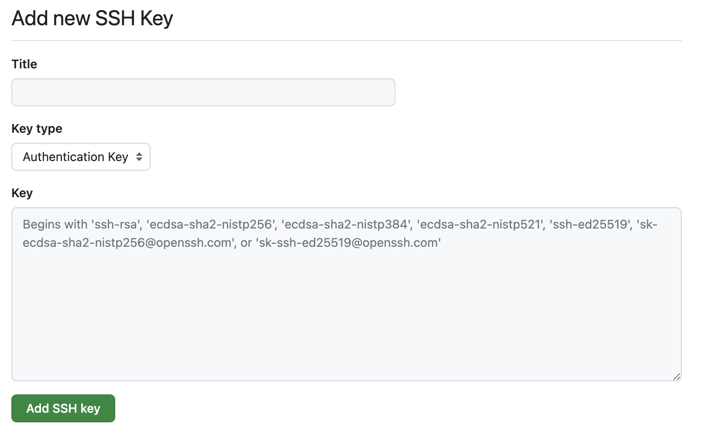
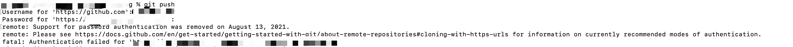

# git笔记

## 生成SSH添加到GitHub

```
git config --global user.name "yourname"
git config --global user.email "youremail"
```

这里的`yourname`输入你的`GitHub`用户名，`youremail`输入你`GitHub`的邮箱。这样`GitHub`才能知道你是不是对应它的账户。

用以下两条命令检查

```
git config user.name
git config user.email
```

然后创建`SSH`,一路回车

```
ssh-keygen -t rsa -C "youremail"
```

**ssh，简单来讲，就是一个秘钥，其中，id_rsa是你这台电脑的私人秘钥，不能给别人看的，id_rsa.pub是公共秘钥，可以随便给别人看。把这个公钥放在GitHub上，这样当你链接GitHub自己的账户时，它就会根据公钥匹配你的私钥，当能够相互匹配时，才能够顺利的通过git上传你的文件到GitHub上。**

```
查看公钥
cat ~/.ssh/id_rsa.pub
```

将公钥复制到GitHub

GitHub头像下点击settings——点击SSH and GPG keys——新建一个SSH，将公钥粘贴进去，自己起一个名字。



输入以下命令，出现用户名表示成功

```
ssh -T git@github.com
```


## 设置快速push

.git目录下config文件 

```
[alias]
    	fp = "!f() { git add -A && git commit -m \"fast push\" && git push; }; f"
```


## 无法push

push的时候要求输入用户名和密码，但git不允许http连接，无法push



拉代码的是用的clone地址是https地址

### 方法一

修改.git目录下config文件

将url改为远程地址


### 方法二

通过命令添加远程仓库

```
git remote set-url origin git@github.com:用户名/仓库名.git
git remote -v                                                     
origin	git@github.com:xxx/xxx.git (fetch)
origin	git@github.com:xxx/xxx.git (push)
```

