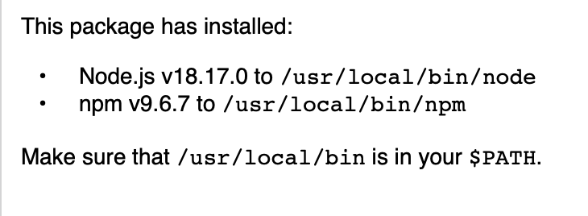
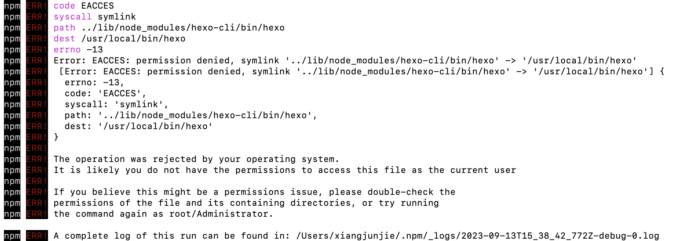

# 新机装机步骤

## nodejs

https://nodejs.cn/download/

官网下载



```
node -v
npm -v
```

## vscode

https://code.visualstudio.com/docs/?dv=osx

官网下载

git登陆，同步配置


## hexo

https://blog.csdn.net/qq_58608526/article/details/124652412

```
拉代码
git clone https://github.com/XXX-Ginger/XXX-Ginger.github.io.git /Users/xiangjunjie/Desktop/myBlog
git checkout -b myblog origin/myblog
npm install hexo-cli -g 
rm -rf node_modules && npm install --force
```

## Npm

```
npm install XXX
报错
```



```
添加权限
sudo chown -R $USER /usr/local/lib/node_modules
sudo chown -R $USER /usr/local/bin
```

